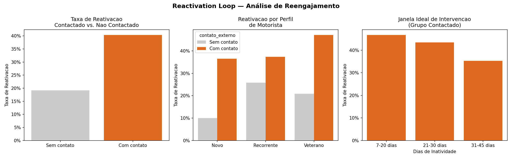

# 🔄 Reactivation Loop — Reengajamento de Motoristas via Canal Externo


> Análise de produto para reativar motoristas inativos da 99 via WhatsApp, identificando a janela ideal de intervenção e o segmento com maior taxa de retorno.

---

## 📌 Contexto do Negócio

Motoristas da 99 ficam inativos após 30 dias sem corridas, impactando diretamente a **disponibilidade de oferta** e a **receita da operação**. A área de Ride Hailing buscou uma solução fora do aplicativo para reengajar esses motoristas antes que o churn se consolidasse.

**Solução proposta:** fluxo automático de reengajamento via WhatsApp ativado a partir dos 15 dias de inatividade, com mensagem personalizada por perfil de motorista.

---

## 🎯 Hipótese

> Motoristas contactados via canal externo nos primeiros 15 dias de inatividade reativam mais do que os não contactados.

---

## 👤 Usuário-alvo

Motoristas com 15 a 45 dias sem corridas, segmentados por tempo de plataforma:

| Perfil | Tempo na plataforma |
|--------|-------------------|
| 🟢 Novo | 0–3 meses |
| 🟡 Recorrente | 3–12 meses |
| 🔵 Veterano | +12 meses |

---

## 📊 Métricas de Sucesso

| Métrica | Critério |
|--------|---------|
| Taxa de reativação (grupo contactado) | ≥ 30% |
| Janela ideal de intervenção | Identificada |
| Segmento com melhor resposta | Identificado para priorização |

---

## 🔬 Metodologia

Simulação com **500 motoristas** (split 50/50 entre grupo contactado e controle), modelando a probabilidade de reativação com base em:

- Recebeu contato externo → **+20pp**
- Perfil Veterano → **+10pp** | Recorrente → **+5pp**
- Inativo há ≤ 20 dias → **+10pp**

---

## 📈 Resultados

### Taxa de Reativação: Contactado vs. Controle
Motoristas que receberam contato externo apresentaram taxa de reativação **~20 pontos percentuais** acima do grupo controle, superando o critério de sucesso de 30%.

### Janela Ideal de Intervenção
A janela **7–20 dias** concentrou a maior taxa de reativação entre os motoristas contactados — intervir cedo é significativamente mais eficaz.

### Segmento Prioritário
**Veteranos** responderam melhor ao contato do que Recorrentes e Novos, combinando maior taxa de retorno com maior valor histórico para a plataforma.



---

## 💡 Principais Insights

- Contato externo eleva a taxa de reativação em **~20pp** vs. ausência de contato
- A janela de **7–20 dias** de inatividade é a mais eficaz para intervenção
- Motoristas **Veteranos** têm a maior taxa de retorno ao serem contactados
- Intervir após **30 dias** de inatividade reduz significativamente a efetividade

---

## ✅ Recomendação

Priorizar contato via WhatsApp nos **primeiros 15 dias de inatividade**, começando pelo segmento **Veterano** — maior taxa de retorno e maior valor histórico para a plataforma.

### Próximos passos
- Validar hipótese com dados reais em coorte pequena
- Teste A/B com duas versões de mensagem
- Definir SLA de resposta para considerar reativação confirmada

---

## 🚀 Como Executar

```bash
# 1. Clone o repositório
git clone https://github.com/yasminguedestech/reactivation-loop.git
cd reactivation-loop

# 2. Instale as dependências
pip install pandas numpy matplotlib seaborn

# 3. Execute o notebook
jupyter notebook reactivation_loop.ipynb
```

---

## 🗂️ Estrutura do Projeto

```
reactivation-loop/
├── reactivation_loop.ipynb   # Análise completa com visualizações
├── reactivation_loop.png     # Output dos gráficos
└── README.md
```

---

## 🛠️ Ferramentas Utilizadas

| Categoria | Ferramenta | Uso |
|-----------|-----------|-----|
| Linguagem |  | Desenvolvimento completo |
| Dados |  | Manipulação e análise |
| Numérico |  | Simulação e cálculos |
| Visualização |  | Gráficos base |
| Visualização |  | Gráficos estatísticos |
| Notebook |  | Análise interativa |
| Versionamento |  | Controle de versão |
| Repositório |  | Hospedagem do projeto |

---

## 📎 Sobre o Projeto

Projeto desenvolvido para portfólio de produto e análise de dados, simulando um cenário real de operações de Ride Hailing. Abrange desde a definição do problema e hipótese de produto até a análise quantitativa com recomendação estratégica orientada a negócio.
